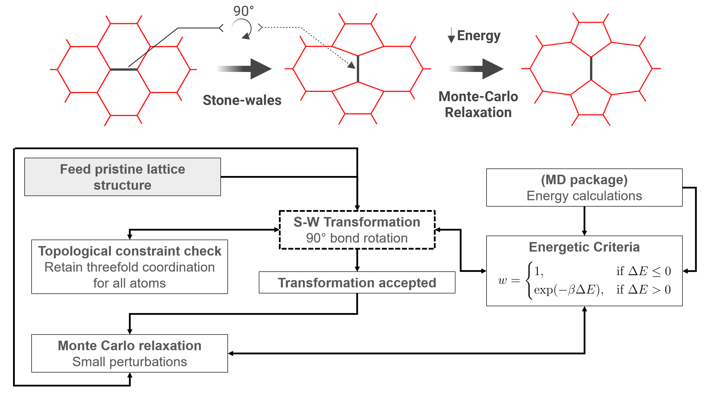

# AmorphGen (Amorphous Structure Generator and analyzer)

Welcome to the **AmorphGen** repository! This package provides tools to generate amorphous structures from 2D hexagonal lattices and analyze their properties. This README focuses on generating the structure and analyzing the resulting configurations.



## Features

- **Lattice Generation**: Generate lattice structures with defects and periodic boundary conditions.
- **Vertex and Connectivity Data**: Outputs vertex positions and connectivity matrix for further analysis.
- **Periodic Boundary Conditions**: Ensures lattice generation and visualization respect periodic boundaries.
- **Defect Creation**: Introduce defects into the lattice and relax the structure using Monte Carlo simulations.
- **Structure Analysis**: Analyze bond lengths, bond angles, ring statistics, and local order parameters.
- **Extended XYZ Conversion**: Convert the structures to extended XYZ format for further use in visualization or simulation software.

---

## Installation

To use this package:

1. Clone the repository:
    ```bash
    git clone https://github.com/yourusername/amorphous-structure-generator.git
    ```
2. Ensure you have MATLAB and the necessary dependencies installed.

---

## Generating structures (Defect_generator.m)

### Lattice Generation
The package generates a hexagonal lattice with a specified number of unit cells and defects.

#### How It Works
1. **Hexagonal Unit Cell**: A predefined unit cell with `Nc` atoms is tiled across the simulation box.
   - Each unit cell has relative atom positions defined by a hexagonal geometry.
   - The lattice dimensions (`Lx` and `Ly`) are scaled based on the number of unit cells along the x- and y-axes (`Na1` and `Na2`).

2. **Scaling Factor**: The atom positions are scaled uniformly to adjust the lattice spacing, ensuring consistency with physical dimensions.

3. **Connectivity Matrix**: A matrix (`H`) is initialized to represent the bonds between atoms. Connectivity is determined based on interatomic distances and periodic boundary conditions.

#### Parameters
- **Nc**: Number of atoms in a unit cell.
- **Na1, Na2**: Number of unit cells along the x- and y-axes, respectively.
- **Nd**: Number of defects to introduce.
- **scaling_factor**: Adjust the lattice spacing.

#### Example MATLAB Usage
```matlab
% Initialize parameters
Nc = 4; Na1 = 7; Na2 = 11; Nd = 2; scaling_factor = 1.428;

% Generate the lattice
Defect_generator(Nc, Na1, Na2, Nd, scaling_factor);
```

### Defect Creation
Defects are introduced through a **Stone-Wales (S-W) Transformation**:
1. **Random Bond Selection**: A random atom and one of its bonds are selected for the transformation.
2. **90° Bond Rotation**: The selected bond is rotated to create a new defect topology. This involves swapping neighbors while retaining the threefold coordination constraint for all atoms.
3. **Energy Optimization**: 
   - Calculate the energy difference (ΔE) before and after the transformation using molecular dynamics (MD) energy calculations.
   - The transformation is accepted if ΔE ≤ 0. Otherwise, it is probabilistically accepted with a weight:

$$
     \[ w = \begin{cases} 
     1, & \text{if } \Delta E \leq 0, \\
     \exp(-\beta \Delta E), & \text{if } \Delta E > 0.
     \end{cases} \]
$$

4. **Connectivity Update**: The connectivity matrix is updated to reflect the new defect configuration.


#### Output Files
- **`connectivity_matrix.txt`**: Adjacency matrix defining bond connections.
- **`vertex.txt`**: Vertex positions and simulation box dimensions.

---

### Structure Relaxation
After generating the lattice and introducing defects, the structure is relaxed using Monte Carlo simulations to improve stability.

#### How It Works
1. **Small Perturbations**: Atoms are randomly displaced within a small range to test new configurations.
2. **Energy Evaluation**: Bond lengths and angles are calculated to evaluate the total energy.
3. **Acceptance Criteria**: A move is accepted if it reduces the energy or satisfies the Metropolis condition.

#### Relaxation Example
```matlab
% Relax the structure
relax();
```

## Structure Analysis (struc_analyzer.m)
The resulting structure can be analyzed to extract key properties such as bond lengths, bond angles, ring statistics, and local order parameters.

#### How It Works
1. **Bond Lengths and Angles**:
   - Calculate bond lengths between connected atoms and visualize their distribution.
   - Compute bond angles for each atom based on its neighbors.

2. **Ring Statistics**:
   - Identify rings of various sizes using Python integration through `ring_statistics.py`.
   - Plot the distribution of ring sizes.

3. **Triatic Order Parameter (q₃)**:
   - Quantify the local atomic environment symmetry using spherical harmonics.


#### Output Files
- **Structure Plot**: Visualization of the lattice with periodic boundaries (`log_files_plot/structure_plot.png`).
- **Bond Statistics**: Histograms of bond lengths and bond angles (`log_files_plot/bond_statistics_plot.png`).
- **Ring Statistics**: Distribution of ring sizes (`log_files_plot/ring_statistics_plot.png`).
- **Triatic Order Parameter**: Average q₃ value displayed in the console.


---

## Extended XYZ Conversion (convertoxyz.m)
Structures can be exported to the extended XYZ format for visualization or use in other tools.


#### Output File
- **Extended XYZ File**: A standard `.xyz` file containing atom coordinates and box dimensions (`output_structure.xyz`).

---


## Contributing
Contributions are welcome! Please:
1. Fork the repository.
2. Create a feature branch.
3. Submit a pull request with details about your changes.


---

## Contact
For questions or feedback, feel free to open an issue or contact me.

Happy coding!

